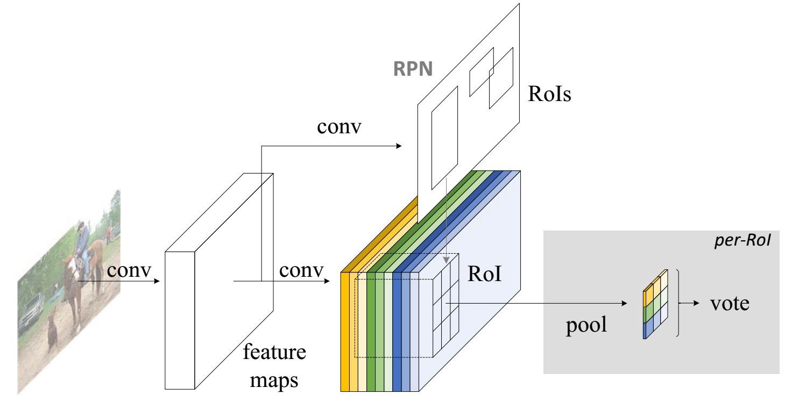
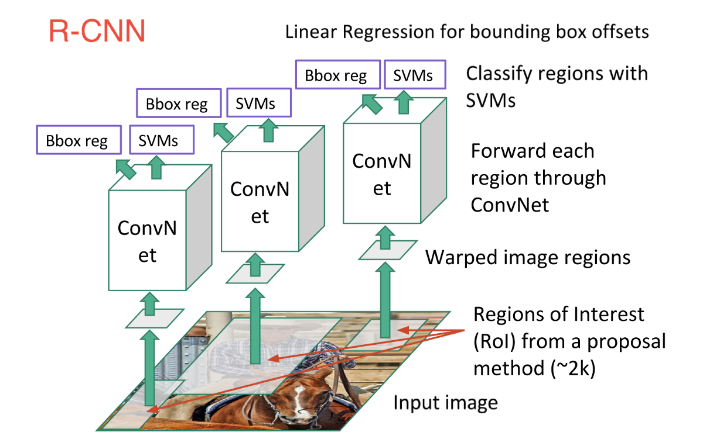
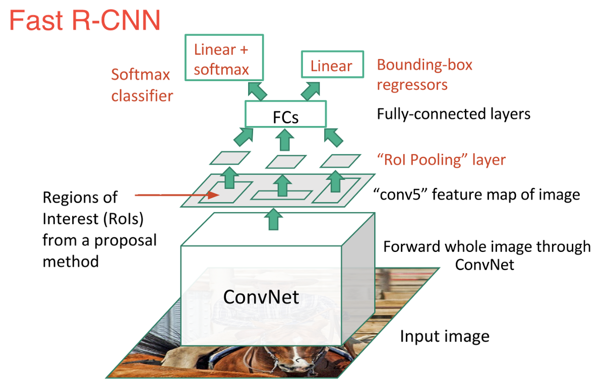
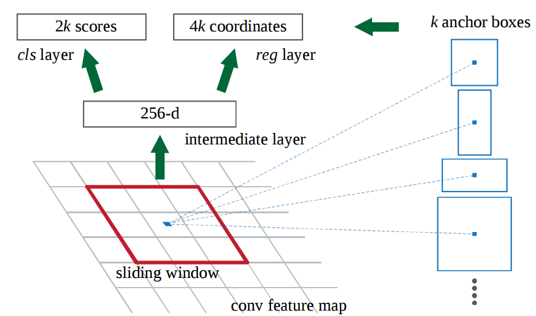
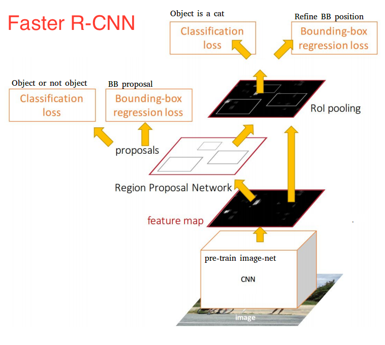
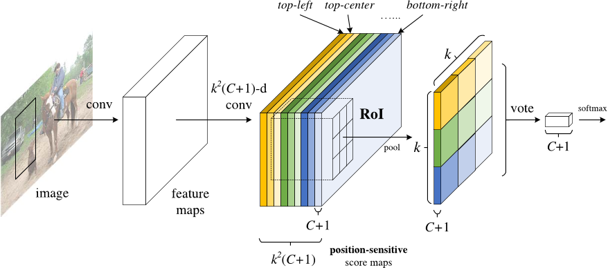
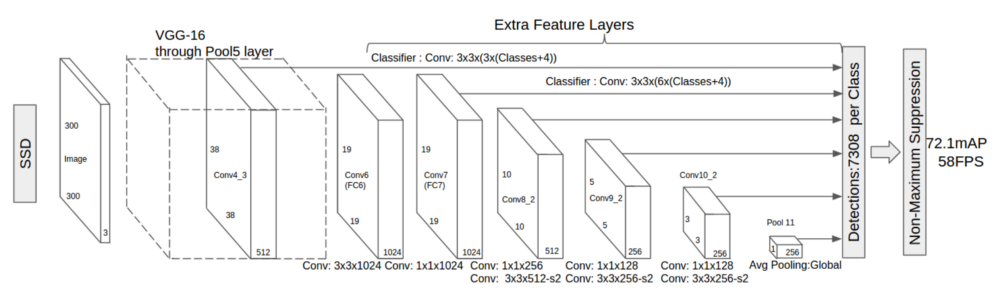
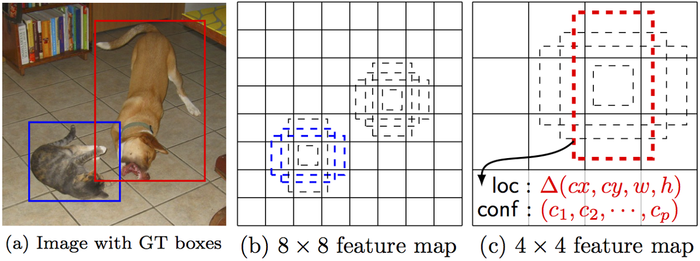

# 深度学习目标检测模型全面综述

- date: 2017-09-18
- tags: Faster R-CNN, R-FCN, SSD

Faster R-CNN,R-FCN和SSD是三种目前最优且应用最广泛的目标检测模型,其他流行的模型通常与这三者类似.本文介绍了深度学习目标检测的三种常见模型:Faster R-CNN,R-FCN和SSD.

随着自动驾驶汽车,智能监控摄像头,面部识别以及大量对人有价值的应用出现.快速,精准的目标检测系统市场也日益蓬勃.这些系统除了可以对图像中的每个目标进行识别,分类以外,它们还可以通过在该目标周围绘制适当大小的边界框(bounding box)来对其进行定位.这让目标检测技术较传统计算机视觉处理技术(图像分类)而言,难度上升了不少.

然而,幸运的是,目前最成功的目标检测方法是对图像分类模型的扩展.几个月前,Google为Tensorflow发布了一个新的目标检测API.与其同时发布的还有针对一些特定模型预构建的框架和权重:

- 基于MobileNets框架的Single Shot Multibox Detector(SSD)模型
- 基于Inception V2框架的SSD模型
- 使用ResNet-101框架的基于Region的全卷积网络(R-FCN)模型
- 基于ResNet-101框架的Faster RCNN模型
- 基于Inception ResNet v2的Faster RCNN模型

## FASTER R-CNN
Faster R-CNN模型现在是一个典型的基于深度学习的目标检测模型.在它的启发下,出现了很多目标检测与分割模型,比如本文中我们将会看到的另外两个模型.然而,要真正开始了解Faster R-CNN之前,我们需要理解R-CNN和Fast R-CNN.

### R-CNN
R-CNN,或称Region-based Convolutional Neural Network,其工作包含了三个步骤:

- 借助一个可以生成约2000个region proposal的选择性搜索(Selective Search)算法,R-CNN可以对输入图像进行扫描,来获取可能出现的目标
- 在每个region proposal上都运行一个卷积神经网络(CNN)
- 将每个CNN的输出都输入进:a)一个支持向量机,以对上述区域进行分类;b)一个线性回归器,以收缩目标周围的边界框,前提是这样的目标存在

换句话说,首先,我们给出一些建议区域;然后,从中提取出特征;之后,再根据这些特征来对这些区域进行分类.本质而言,我们将目标检测转化成了图像分类问题.R-CNN模型虽然非常直观,但是速度很慢.

### Fast R-CNN
直接承接R-CNN的是Fast R-CNN.Fast R-CNN在很多方面与R-CNN类似.但是凭借两项主要的增强手段,其检测速度较R-CNN有所提高:

- 在推荐区域之前,先对图像执行特征提取工作,通过这种办法,后面只用对整个图像使用一个CNN(之前的R-CNN网络需要在2000个重叠的区域上分别运行2000个CNN)
- 将支持向量机替换成了一个softmax层,这种变化并没有创建新的模型,而是将神经网络进行了扩展以用于预测工作

现在我们基于网络最后的特征图(而非原始图像)创建了region proposals.因此,我们对整幅图只用训练一个CNN就可以了.

此外,我们使用了一个softmax层来直接输出类(class)的概率,而不是像之前一样训练很多不同的SVM去对每个目标类(object class)进行分类.现在,我们只用训练一个神经网络,而之前我们需要训练一个神经网络以及很多SVM.

就速度而言,Fast R-CNN提升了许多.然而,存在一大未解决的瓶颈:用于生成region proposal的选择搜索算法(selective search algorithm).

### FASTER R-CNN
Faster R-CNN的主要创新是,它用一个快速神经网络代替了之前慢速的选择搜索算法(selective search algorithm).具体而言,它引入了一个region proposal网络(RPN).RPN工作原理:

- 在最后卷积得到的特征图上,使用一个`3x3`的窗口在特征图上滑动,然后将其映射到一个更低的维度上(如256维)
- 在每个滑动窗口的位置上,RPN都可以基于k个固定比例的anchor box(默认的边界框)生成多个可能的区域
- 每个region proposal都由两部分组成:a)该区域的objectness分数;b)4个表征该区域边界框的坐标

换句话说,我们会观察我们最后特征图上的每个位置,然后关注围绕它的k个不同的anchor box:一个高的框,一个宽的框,一个大的框等等.对于每个这些框,不管我们是否认为它包含一个目标,以及不管这个框里的坐标是什么,我们都会进行输出.下图展示了在单个滑动框位置上发生的操作:

图中2k分数代表了k中每一个边界框正好覆盖目标的softmax概率.这里注意到,尽管RPN输出了边界框的坐标,然而它并不会去对任何可能的目标进行分类:它惟一的工作仍然是给出对象区域.如果一个anchor box在特定阈值之上存在一个objectness分数,那么这个边界框的坐标就会作为一个region proposal被向前传递.

一旦我们有了region proposal我们就直接把他们输入一个本质上是Fast R-CNN的模型.我们再添加一个池化层,一些全连接层以及最后,一个softmax分类层和边界框回归器(bounding box regressor).所以在某种意义上,`Faster R-CNN = RPN + Fast R-CNN`.

总体而言,Faster R-CNN较Fast R-CNN在速度上有了大幅提升,而且其精确性也达到了最尖端的水平.值得一提的是,尽管未来的模型能够在检测速度上有所提升,但是几乎没有模型的表现能显著超越Faster R-CNN.换句话说,Faster R-CNN也许不是目标检测最简单最快的方法,但是其表现还是目前最佳的.例如,Tensorflow应用Inception ResNet打造的Faster R-CNN就是他们速度最慢,但却最精准的模型.

也许Faster R-CNN看起来可能会非常复杂,但是它的核心设计还是与最初的R-CNN一致:先假设对象区域,然后对其进行分类.目前,这是很多目标检测模型使用的主要思路,包括我们接下来将要提到的这个模型.

## R-FCN
还记得Fast R-CNN是如何通过在所有region proposal上共享同一个CNN来改善检测速度的吗?这也是设计R-FCN的一个动机:通过最大化共享计算来提升速度.

R-FCN,或称Region-based Fully Convolutional Net(基于区域的全卷积网络),可以在每个输出之间完全共享计算.作为全卷积网络,它在模型设计过程中遇到了一个特殊的问题:

1. 当对一个目标进行分类任务时,我们希望学到模型中的位置不变性(location invariance),无论这只猫出现在图中的哪个位置,我们都想将它分类成一只猫
2. 当进行目标检测任务时,我们希望学习到位置可变性(location variance),如果这只猫在左上角,那么我们希望在图像左上角这个位置画一个框

所以,问题出现了,如果想在网络中100%共享卷积计算的话,我们应该如何在位置不变性(location invariance)和位置可变性(location variance)之间做出权衡呢?R-FCN的解决方案:

位置敏感分数图.每个位置敏感分数图都代表了一个目标类(object class)的一个相关位置.例如,只要是在图像右上角检测到一只猫,就会激活一个分数图(score map).而当系统看见左下角出现一辆车时,另一个分数图也将会被激活.本质上来讲,这些分数图都是卷积特征图,它们被训练来识别每个目标的特定部位.

以下是R-FCN的工作方式:

- 在输入图像上运行一个CNN
- 添加一个全卷积层,以生成位置敏感分数图的score bank.这里应该有`k^2(C+1)`个分数图,其中`k^2`代表切分一个目标的相关位置的数量(比如,`3^2`代表一个`3x3`的空间网格),`C+1`代表`C`个类外加一个背景
- 运行一个全卷积region proposal网络(RPN),以生成感兴趣区域(regions of interest, RoI)
- 对于每个RoI,我们都将其切分成同样的`k^2`个子区域,然后将这些子区域作为分数图
- 对每个子区域,我们检查其score bank,以判断这个子区域是否匹配具体目标的对应位置.比如,如果我们处在`上左`子区域,那我们就会获取与这个目标`上左`子区域对应的分数图,并且在感兴趣区域(RoI region)里对那些值取平均.对每个类我们都要进行这个过程
- 一旦每个`k^2`子区域都具备每个类的目标匹配值,那么我们就可以对这些子区域求平均值,得到每个类的分数
- 通过对剩下`C+1`个维度向量进行softmax回归,来对RoI进行分类

下面是R-FCN的示意图,用RPN生成RoI:

当然,即便有上述文字以及图片的解释,你可能仍然不太明白这个模型的工作方式.老实说,当你可以实际看到R-FCN的工作过程时,你会发现理解起来会更加简单.下面就是一个在实践中应用的R-FCN,它正在从图中检测一个婴儿:

我们只用简单地让R-FCN去处理每个region proposal,然后将其切分成子区域,在子区域上反复询问系统:这看起来像是婴儿的`上左`部分吗,这看起来像是婴儿的`上中`部分吗,这看起来像是婴儿的`上右`部分吗,等等.系统会对所有类重复这个过程.如果有足够的子区域表示`是的`(我的确匹配婴儿的这个部分),那么RoI就会通过对所有类进行softmax回归的方式被分类成一个婴儿.

借助这种设置,R-FCN便能同时处理位置可变性(location variance)与位置不变性(location invariance).它给出不同的目标区域来处理位置可变性,让每个region proposal都参考同一个分数图score bank来处理位置不变形.这些分数图应该去学习将一只猫分类成猫,而不用管这只猫在在那个位置.最好的是,由于它是全卷积的,所以这意味着网络中所有的计算都是共享的.

因此,R-FCN比Faster R-CNN快了好几倍,并且可以达到类似的准确率.

## SSD
Single-Shot Detector,和R-FCN一样,它的速度比Faster R-CNN要快很多,但其工作方式却和R-FCN存在显著不同.

我们前两个模型分两个步骤执行region proposal和region classification.首先,它们使用一个region proposal网络来生成感兴趣区域(region of interest);然后,它们既可以用全连接层也可以用位置敏感卷积层来对那些区域进行分类.然而,SSD可以在单个步骤中完成上述两个步骤,并且在处理图像的同时预测边界框和类.

具体而言,给定一个输入图像以及一系列真值标签,SSD就会进行如下操作:

- 在一系列卷积层中传递这个图像,产生一系列大小不同的特征图(如10x10,6x6,3x3等等)
- 对每个这些特征图中的每个位置都使用一个`3x3`的卷积滤波器(convolutional filter)来评估一小部分默认的边界框.这些默认边的界框本质上等价于Faster R-CNN的anchor box
- 对每个边界框都同时执行预测:a)边界框的偏移;b)分类的概率
- 在训练期间,用这些基于IoU(Intersection over Union,也被称为Jaccard相似系数)系数的预测边界框来匹配正确的边界框.被最佳预测的边界框将被标签为`正`,并且其它边界框的IoU大于0.5

SSD的工作方式听上去很直接,但是训练它却会面临一个不一般的挑战.在之前那两个模型那里,region proposal网络可以确保每个我们尝试进行分类的对象都会有一个作为目标的最小概率值.然而,在SSD这里,我们跳过了这个筛选步骤.我们从图像中每个单一位置那里进行分类并画出形状,大小不同的边界框.通过这种办法,我们可以生成比别的模型更多的边界框,但是它们基本上全是负面样本.

为了解决这个问题,SSD进行了两项处理:

- 首先,它使用非极大值抑制(non maximum suppression,NMS)技术来将高度重叠的边界框整合成一个.换句话说,如果有4个形状尺寸等类似的边界框中有同一只狗,那么NMS就会保留信度最高的那个边界框而抛弃掉其它的
- 第二,SSD模型使用了一种被称为hard negative mining的技术以在训练过程中让类保持平衡.在hard negative mining中,只有那些有最高训练损失(training loss)的负面样本(negative example)子集才会在每次训练迭代中被使用.SSD的正负比一直保持在`1:3`

下图是SSD的架构示意图:

如上所述,最终有可缩小尺寸的额外特征层.这些尺寸变化的特征图有助于捕捉不同大小的目标.例如,下面是一个正在执行的SSD.

在更小的特征图中(比如4x4),每一单元覆盖图像的一个更大区域,使其探测更大的目标.region proposal与分类同时被执行:假设p为目标类别,每个边界框与一个`(4+p)`维度向量相连接,其输出`4`个框偏移坐标和`p`分类概率.在最后一步中,softmax又一次被用来分类目标.

最终,SSD与最初的两个模型并无不同.它简单跳过region proposal这一步,而不是同时考虑图像每个位置的每个边界及其分类.由于SSD一次性完成所有,它是三个模型中最快的,且相对而言依然表现出色.

## 结论
Faster R-CNN,R-FCN和SSD是三种目前最优且应用最广泛的目标检测模型.其他流行的模型通常与这三者类似,都依赖于深度CNN(如ResNet,Inception等)来进行网络初始化,且大部分遵循同样的proposal/分类pipeline.但是,使用这些模型需要了解Tensorflow的API.Tensorflow有一份使用这些模型的初学者教程.