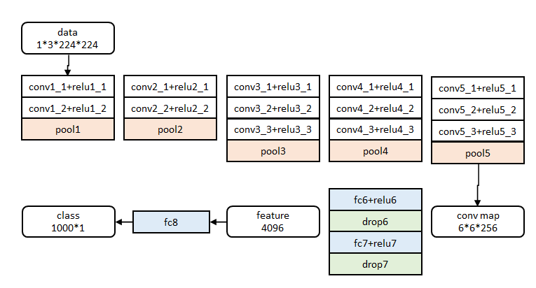
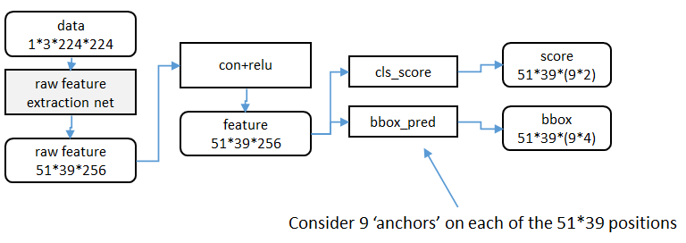

# RCNN算法详解
Region CNN(RCNN)可以说是利用深度学习进行目标检测的开山之作.作者Ross Girshick多次在PASCAL VOC的目标检测竞赛中摘桂,2010年更带领团队获得终身成就奖.

目标检测中的两个关键问题:

1. 速度:经典的目标检测算法使用滑动窗法依次判断所有可能的区域.本文则预先提取一系列较可能是物体的候选区域,之后仅在这些候选区域上提取特征,进行判断
2. 训练集:一个较大的识别库(ImageNet ILSVC 2012),标定每张图片中物体的类别,一千万图像,1000类;一个较小的检测库(PASCAL VOC 2007),标定每张图片中,物体的类别和位置,一万图像,20类

## 流程

1. 一张图像生成`1K~2K`个候选区域
2. 对每个候选区域,使用深度网络提取特征
3. 特征送入每一类的SVM分类器,判别是否属于该类
4. 使用回归器精细修正候选框位置

### 候选区域生成
使用了Selective Search方法从一张图像生成约`2000-3000`个候选区域.基本思路如下:

1. 使用一种过分割手段,将图像分割成小区域
2. 查看现有小区域,合并可能性最高的两个区域.重复直到整张图像合并成一个区域
3. 输出所有曾经存在过的区域,所谓候选区域

候选区域生成和后续步骤相对独立,实际可以使用任意算法进行.

合并规则:

1. 颜色(颜色直方图)相近的
2. 纹理(梯度直方图)相近的
3. 合并后总面积小的
4. 合并后总面积在其BBOX中所占比例大的

第3条保证合并操作的尺度较为均匀,避免一个大区域陆续`吃掉`其他小区域.第四条保证合并后形状规则.上述四条规则只涉及区域的颜色直方图,纹理直方图,面积和位置.合并后的区域特征可以直接由子区域特征计算而来,速度较快.

## 特征提取
使用深度网络提取特征之前,首先把候选区域归一化成同一尺寸`227x227`.此处有一些细节可做变化:外扩的尺寸大小,形变时是否保持原比例,对框外区域直接截取还是补灰.

### 预训练
网络借鉴Hinton 2012年在Image Net上的分类网络.提取的特征为4096维,之后送入一个`4096->1000`的全连接`fc`层进行分类,学习率0.01.训练数据使用ILVCR 2012的全部数据进行训练,输入一张图片,输出1000维的类别标号.

### 调优训练
同样使用上述网络,最后一层换成`4096->21`的全连接网络.学习率0.001,每一个batch包含32个正样本(属于20类)和96个背景.训练数据使用PASCAL VOC 2007的训练集,输入一张图片,输出21维的类别标号,表示`20类+背景`.考察一个候选框和当前图像上所有标定框重叠面积最大的一个.如果重叠比例大于0.5,则认为此候选框为此标定的类别,否则认为此候选框为背景.

## 类别判断

1. 正样本:本类的真值标定框
2. 负样本:考察每一个候选框,如果和本类所有标定框的重叠都小于0.3,认定其为负样本

## 位置精修
目标检测问题的衡量标准是重叠面积:许多看似准确的检测结果,往往因为候选框不够准确,重叠面积很小.故需要一个位置精修步骤:

1. 回归器:对每一类目标,使用一个线性回归器进行精修,正则项`λ=10000`.输入为深度网络的4096维特征,输出为xy方向的缩放和平移
2. 训练样本:判定为本类的候选框中和真值重叠面积大于0.6的候选框

## Fast RCNN
继2014年的RCNN之后,Ross Girshick在15年推出Fast RCNN,构思精巧,流程更为紧凑,大幅提升了目标检测的速度.

RCNN使用以下四步实现目标检测:

1. 在图像中确定约`1000-2000`个候选框
2. 对于每个候选框内图像块使用深度网络提取特征
3. 对候选框中提取出的特征使用分类器判别是否属于一个特定类
4. 对于属于某一特征的候选框用回归器进一步调整其位置

改进的Fast RCNN:

1. 测试时速度慢:RCNN一张图像内候选框之间大量重叠,提取特征操作冗余;Fast RCNN将整张图像归一化后直接送入深度网络,在邻接时,才加入候选框信息,在末尾的少数几层处理每个候选框
2. 训练时速度慢:RCNN一张图像内候选框之间大量重叠,提取特征操作冗余;Fast RCNN将一张图像送入网络,紧接着送入从这幅图像上提取出的候选区域,这些候选区域的前几层特征不需要再重复计算
3. 训练所需空间大:RCNN中独立的分类器和回归器需要大量特征作为训练样本;Fast RCNN把类别判断和位置精调统一用深度网络实现,不再需要额外存储

### 特征提取
图像归一化为`224×224`直接送入网络,前五阶段是基础的`conv+relu+pooling`形式,在第五阶段结尾输入P个候选区域`(图像序号×1+几何位置×4)`.

#### roi_pool层的测试(forward)
roi_pool层将每个候选区域均匀分成`M×N`块,对每块进行max pooling.将特征图上大小不一的候选区域转变为大小统一的数据,送入下一层.

### 网络参数训练
网络除去末尾部分如下图,在ImageNet上训练1000类分类器.结果参数作为相应层的初始化参数:

其余参数随机初始化.

在调优训练时,每一个mini-batch中首先加入N张完整图片,而后加入从N张图片中选取的R个候选框.这R个候选框可以复用N张图片前5个阶段的网络特征.实际选择`N=2,R=128`.

训练数据N张完整图片以50%概率水平翻转,R个候选框的构成方式:

- 前景:25%,与某个真值重叠在`[0.5,1]`的候选框
- 背景:75%,与真值重叠的最大值在`[0.1,0.5)`的候选框

### 分类与位置调整
第五阶段的特征输入到两个并行的全连层中(multi-task):

`cls_score`层用于分类,输出`K+1`维数组p,表示属于K类和背景的概率.`bbox_pred`层用于调整候选区域位置,输出`4xK`维数组t,表示分别属于K类时,应该平移缩放的参数.

## Faster RCNN
从RCNN到fast RCNN,再到faster RCNN,目标检测的四个基本步骤`候选区域生成,特征提取,分类,位置精修`终于被统一到一个深度网络框架之内.所有计算没有重复,完全在GPU中完成,大大提高了运行速度.

faster RCNN可以简单地看做`区域生成网络+fast RCNN`的系统,用区域生成网络代替fast RCNN中的Selective Search方法.这个系统中的三个问题:

1. 如何设计区域生成网络
2. 如何训练区域生成网络
3. 如何让区域生成网络和fast RCNN网络共享特征提取网络

### 区域生成网络:结构
基本设想是在提取好的特征图上对所有可能的候选框进行判别.由于后续还有位置精修步骤,所以候选框实际比较稀疏.

原始特征提取(上图灰色方框)包含若干层`conv+relu`,直接套用ImageNet上常见的分类网络即可.
额外添加一个`conv+relu`层,输出`51x39x256`维特征.

特征可以看做一个尺度`51x39`的256通道图像,对于该图像的每一个位置,考虑9个可能的候选窗口`三种面积{128^2,256^2,512^2}x三种比例{1:1,1:2,2:1}`.这些候选窗口称为anchors.下图示出`51x39`个anchor中心,以及9种anchor示例:

分类层`cls_score`输出每一个位置上9个anchor属于前景和背景的概率,窗口回归层`bbox_pred`输出每一个位置上9个anchor对应窗口应该平移缩放的参数.对于每一个位置来说,分类层从256维特征中输出属于前景和背景的概率,窗口回归层从256维特征中输出4个平移缩放参数.

就局部来说,这两层是全连接网络;就全局来说,由于网络在所有位置`51x39个`的参数相同,所以实际用尺寸为`1×1`的卷积网络实现.

实际代码中,将`51x39x9`个候选位置根据得分排序,选择最高的一部分,再经过Non-Maximum Suppression获得2000个候选结果之后才送入分类器和回归器.所以Faster-RCNN和RCNN,Fast-RCNN一样属于2-stage的检测算法.

### 区域生成网络:训练
考察训练集中的每张图像:

1. 对每个标定的真值候选区域,与其重叠比例最大的anchor记为前景样本
2. 对`[1]`剩余的anchor,如果其与某个标定重叠比例大于0.7,记为前景样本;如果其与任意一个标定的重叠比例都小于0.3,记为背景样本
3. 对`[1],[2]`剩余的anchor弃去不用
4. 跨越图像边界的anchor弃去不用

原始特征提取网络使用ImageNet的分类样本初始化,其余新增层随机初始化.每个mini-batch包含从一张图像中提取的256个anchor,前景背景样本`1:1`.前60K迭代,学习率0.001,后20K迭代,学习率0.0001.
momentum设置为0.9,weight decay设置为0.0005.