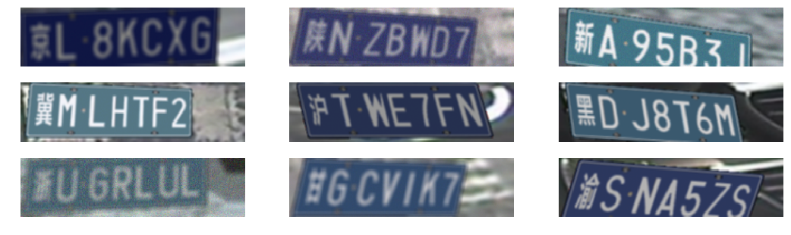

车牌生成器,参考[szad670401](https://github.com/szad670401/end-to-end-for-chinese-plate-recognition)实现,对代码进行了精简,支持py3.依赖项:

```
pip install Pillow opencv-python numpy
```

建议编译安装OpenCV3.2,包含扩展部分.

python运行示例:
```python
import genplate

G = genplate.GenPlate()
txts, imgs = G.gen_batch(9, './tmps')


from pyhej.image import image_view

image_view.image_show_path(['./tmps/%03d.jpg'%i for i in range(len(txts))], col=3, height=0.3).show()

image_view.image_show_imgs(imgs, col=3, height=0.3, mode='bgr').show()
```

