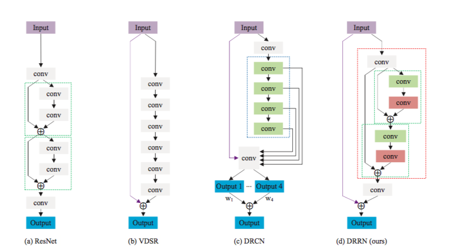

超分辨率技术(Super-Resolution, SR)是指从观测到的低分辨率图像重建出相应的高分辨率图像,在监控设备/卫星图像和医学影像等领域都有重要的应用价值.本文针对端到端的基于深度学习的单张图像超分辨率方法(Single Image Super-Resolution, SISR),总结一下从SRCNN到EDSR的发展历程.排列顺序大致按论文中给出的4倍上采样结果的峰值信噪比从低到高排列.

## SRCNN 2014 [paper](http://personal.ie.cuhk.edu.hk/~ccloy/files/eccv_2014_deepresolution.pdf)
SRCNN是深度学习用在超分辨率重建上的开山之作.SRCNN的网络结构非常简单,仅仅用了三个卷积层.

SRCNN首先使用双三次(bicubic)插值将低分辨率图像放大成目标尺寸,接着通过三层卷积网络拟合非线性映射,最后输出高分辨率图像结果.作者将三层卷积的结构解释成三个步骤:图像块的提取和特征表示,特征非线性映射和最终的重建.

三个卷积层使用的卷积核的大小分为为`9x9`,`1x1`和`5x5`.前两个的输出特征个数分别为64和32.用Timofte数据集(包含91幅图像)和ImageNet大数据集进行训练.使用均方误差(Mean Squared Error, MSE)作为损失函数,有利于获得较高的PSNR.

## FSRCNN 2016 [paper](https://arxiv.org/abs/1608.00367)
FSRCNN与SRCNN都是香港中文大学Dong Chao,Xiaoou Tang等人的工作.FSRCNN是对之前SRCNN的改进,主要在三个方面:一是,在最后使用了一个反卷积层放大尺寸,因此可以直接将原始的低分辨率图像输入到网络中,而不是像之前SRCNN那样需要先通过bicubic方法放大尺寸;二是,改变特征维数,使用更小的卷积核和使用更多的映射层;三是,可以共享其中的映射层,如果需要训练不同上采样倍率的模型,只需要fine-tuning最后的反卷积层.

由于FSRCNN不需要在网络外部进行放大图片尺寸的操作,同时通过添加收缩层和扩张层,将一个大层用一些小层来代替,因此FSRCNN与SRCNN相比有较大的速度提升.FSRCNN在训练时也可以只fine-tuning最后的反卷积层,因此训练速度也更快.

## ESPCN 2016 [paper](https://arxiv.org/abs/1609.05158)
像SRCNN那样的方法,由于需要将低分辨率图像通过上采样插值得到与高分辨率图像相同大小的尺寸,再输入到网络中,这意味着要在较高的分辨率上进行卷积操作,从而增加了计算复杂度.

ESPCN的核心概念是亚像素卷积层(sub-pixel convolutional layer).网络的输入是原始低分辨率图像,通过三个卷积层以后,得到通道数为`r**2`的与输入图像大小一样的特征图像.再将特征图像每个像素的`r**2`个通道重新排列成一个`(r, r)`的区域,对应高分辨率图像中一个`(r, r)`大小的子块,从而大小为`(H, W, r**2)`的特征图像被重新排列成`(rH, rW, 1)`的高分辨率图像.

- github(pytorch) https://github.com/leftthomas/ESPCN

## VDSR 2016 [paper](https://arxiv.org/abs/1511.04587)
在介绍VDSR之前,先提一下何恺明在2015年的时候提出的残差网络ResNet.ResNet的提出,解决了之前网络结构比较深时无法训练的问题,性能也得到了提升,ResNet也获得了CVPR2016的best paper.残差网络结构(residual network)被应用在了大量的工作中.

正如在VDSR论文中作者提到,输入的低分辨率图像和输出的高分辨率图像在很大程度上是相似的,也就是指低分辨率图像携带的低频信息与高分辨率图像的低频信息相近,训练时带上这部分会多花费大量的时间,实际上我们只需要学习高分辨率图像和低分辨率图像之间的高频部分残差即可.残差网络结构的思想特别适合用来解决超分辨率问题,可以说影响了之后的深度学习超分辨率方法.VDSR是最直接明显的学习残差的结构.

VDSR将插值后得到的变成目标尺寸的低分辨率图像作为网络的输入,再将这个图像与网络学到的残差相加得到最终的网络的输出.VDSR主要有4点贡献:

1. 加深了网络结构(20层),使得越深的网络层拥有更大的感受野.文章选取3×3的卷积核,深度为D的网络拥有`(2D+1)×(2D+1)`的感受野
2. 采用残差学习,残差图像比较稀疏,大部分值都为0或者比较小,因此收敛速度快.VDSR还应用了自适应梯度裁剪(Adjustable Gradient Clipping),将梯度限制在某一范围,也能够加快收敛过程
3. VDSR在每次卷积前都对图像进行补0操作,这样保证了所有的特征图和最终的输出图像在尺寸上都保持一致,解决了图像通过逐步卷积会越来越小的问题.文中说实验证明补0操作对边界像素的预测结果也能够得到提升
4. VDSR将不同倍数的图像混合在一起训练,这样训练出来的一个模型就可以解决不同倍数的超分辨率问题

- github(tensorflow) https://github.com/Jongchan/tensorflow-vdsr
- github(pytorch) https://github.com/twtygqyy/pytorch-vdsr

## DRCN 2016 [paper](https://arxiv.org/abs/1511.04491)
DRCN与上面的VDSR都是来自首尔国立大学计算机视觉实验室的工作,两篇论文都发表在CVPR2016上,两种方法的结果非常接近.DRCN第一次将之前已有的递归神经网络(Recursive Neural Network)结构应用在超分辨率处理中.同时,利用残差学习的思想,加深了网络结构,增加了网络感受野,提升了性能.

## RED 2016 [paper](https://arxiv.org/abs/1606.08921)
这篇文章提出了由对称的卷积层-反卷积层构成的网络结构,作为一个编码-解码框架,可以学习由低质图像到原始图像端到端的映射.

RED网络的结构是对称的,每个卷积层都有对应的反卷积层.卷积层用来获取图像的抽象内容,反卷积层用来放大特征尺寸并且恢复图像细节.卷积层将输入图像尺寸减小后,再通过反卷积层上采样变大,使得输入输出的尺寸一样.每一组镜像对应的卷积层和反卷积层有着跳线连接结构,将两部分具有同样尺寸的特征(要输入卷积层的特征和对应的反卷积层输出的特征)做相加操作(ResNet那样的操作)后再输入到下一个反卷积层.这样的结构能够让反向传播信号能够直接传递到底层,解决了梯度消失问题,同时能将卷积层的细节传递给反卷积层,能够恢复出更干净的图片.

## DRRN 2017 [paper](http://openaccess.thecvf.com/content_cvpr_2017/papers/Tai_Image_Super-Resolution_via_CVPR_2017_paper.pdf)
DRRN的作者应该是受到了ResNet/VDSR和DRCN的启发,采用了更深的网络结构来获取性能的提升.

DRRN中的每个残差单元都共同拥有一个相同的输入,即递归块中的第一个卷积层的输出.每个残差单元都包含2个卷积层.在一个递归块内,每个残差单元内对应位置相同的卷积层参数都共享(图中DRRN的浅绿色块或浅红色块).作者列出了ResNet/VDSR/DRCN和DRRN四者的主要策略.ResNet是链模式的局部残差学习,VDSR是全局残差学习,DRCN是全局残差学习+单权重的递归学习+多目标优化,DRRN是多路径模式的局部残差学习+全局残差学习+多权重的递归学习.

## LapSRN 2017 [paper](https://arxiv.org/abs/1704.03915)
论文中作者先总结了之前的方法存在有三点问题:(针对这三点问题,作者提出了LapSRN)

- 一是,有的方法在输入图像进网络前,需要使用预先定义好的上采样操作(例如bicubic)来获得目标的空间尺寸,这样的操作增加了额外的计算开销,同时也会导致可见的重建伪影.而有的方法使用了亚像素卷积层或者反卷积层这样的操作来替换预先定义好的上采样操作,这些方法的网络结构又相对比较简单,性能较差,并不能学好低分辨率图像到高分辨率图像复杂的映射
- 二是,在训练网络时使用`l_2`型损失函数时,不可避免地会产生模糊的预测,恢复出的高分辨率图片往往会太过于平滑
- 三是,在重建高分辨率图像时,如果只用一次上采样的操作,在获得大倍数(8倍以上)的上采样因子时就会比较困难.而且在不同的应用时,需要训练不同上采样倍数的模型

LapSRN的结构可以看成有多级,每一级完成一次2倍的上采样操作,要实现8倍的上采样就需要有三级.在每一级中,先通过一些级联的卷积层提取特征,接着通过一个反卷积层将提取出的特征的尺寸上采样2倍.反卷积层后连有两个卷积层,一个卷积层的作用是继续提取特征,另外一个卷积层的作用是预测出这一级的残差.输入图像在每一级也经过一个反卷积层使尺寸上采样2倍,再与对应级的残差相加,就能重构出这一级的上采样结果.

- github(pytorch) https://github.com/twtygqyy/pytorch-LapSRN

## SRDenseNet 2017 [paper](http://openaccess.thecvf.com/content_ICCV_2017/papers/Tong_Image_Super-Resolution_Using_ICCV_2017_paper.pdf)
DenseNet是CVPR2017的best papaer获奖论文.DenseNet在稠密块(dense block)中将每一层的特征都输入给之后的所有层,使所有层的特征都串联(concatenate)起来,而不是像ResNet那样直接相加.这样的结构给整个网络带来了减轻梯度消失问题,加强特征传播,支持特征复用,减少参数数量的优点.SRDenseNet将稠密块结构应用到了超分辨率问题上,取得了不错的效果.

SRDenseNet可以分成四个部分:首先是用一个卷积层学习低层的特征;接着用多个稠密块学习高层的特征;然后通过几个反卷积层学到上采样滤波器参数;最后通过一个卷积层生成高分辨率输出.

## SRGAN(SRResNet) 2017 [paper](https://arxiv.org/abs/1609.04802)
将生成对抗网络(Generative Adversarial Network, GAN)用在了解决超分辨率问题上.文章提到,训练网络时用均方差作为损失函数,虽然能够获得很高的峰值信噪比,但是恢复出来的图像通常会丢失高频细节,使人不能有好的视觉感受.SRGAN利用感知损失(perceptual loss)和对抗损失(adversarial loss)来提升恢复出的图片的真实感.感知损失是利用卷积神经网络提取出的特征,通过比较生成图片经过卷积神经网络后的特征和目标图片经过卷积神经网络后的特征的差别,使生成图片和目标图片在语义和风格上更相似.SRGAN的工作就是:G网通过低分辨率的图像生成高分辨率图像,由D网判断拿到的图像是由G网生成的,还是数据库中的原图像.当G网能成功骗过D网的时候,那我们就可以通过这个GAN完成超分辨率了.用均方误差优化SRResNet(SRGAN的生成网络部分),能够得到具有很高的峰值信噪比的结果.在训练好的VGG模型的高层特征上计算感知损失来优化SRGAN,并结合SRGAN的判别网络,能够得到峰值信噪比虽然不是最高,但是具有逼真视觉效果的结果.

在生成网络部分(SRResNet)部分包含多个残差块,每个残差块中包含两个3×3的卷积层,卷积层后接批规范化层(batch normalization, BN)和PReLU作为激活函数,两个2×亚像素卷积层(sub-pixel convolution layers)被用来增大特征尺寸.在判别网络部分包含8个卷积层,随着网络层数加深,特征个数不断增加,特征尺寸不断减小,选取激活函数为LeakyReLU,最终通过两个全连接层和最终的sigmoid激活函数得到预测为自然图像的概率.

- github(tensorflow) https://github.com/zsdonghao/SRGAN
- github(tensorflow) https://github.com/zsdonghao/tensorlayer
- github(pytorch) https://github.com/twtygqyy/pytorch-SRResNet
- github(pytorch) https://github.com/ai-tor/PyTorch-SRGAN

## EDSR 2017 [paper](https://arxiv.org/abs/1707.02921)
EDSR是NTIRE2017超分辨率挑战赛上获得冠军的方案.如论文中所说,EDSR最有意义的模型性能提升是去除掉了SRResNet多余的模块,从而可以扩大模型的尺寸来提升结果质量.(EDSR在结构上与SRResNet相比,就是把批规范化处理操作给去掉了)

- github(torch) https://github.com/LimBee/NTIRE2017
- github(pytorch) https://github.com/thstkdgus35/EDSR-PyTorch

## Others
- [jiny2001/dcscn-super-resolution](https://github.com/jiny2001/dcscn-super-resolution)
- [tyshiwo/MemNet](https://github.com/tyshiwo/MemNet)

## 推荐阅读
- [深度学习端到端超分辨率方法发展历程](http://blog.csdn.net/abluemouse/article/details/78710553)
- [一篇深度学习超分辨率方法综述](https://arxiv.org/abs/1706.09077)
- [github上一个超分辨率方法的总结](https://github.com/YapengTian/Single-Image-Super-Resolution)
- [pix2pix and CycleGAN](https://github.com/junyanz/pytorch-CycleGAN-and-pix2pix)
